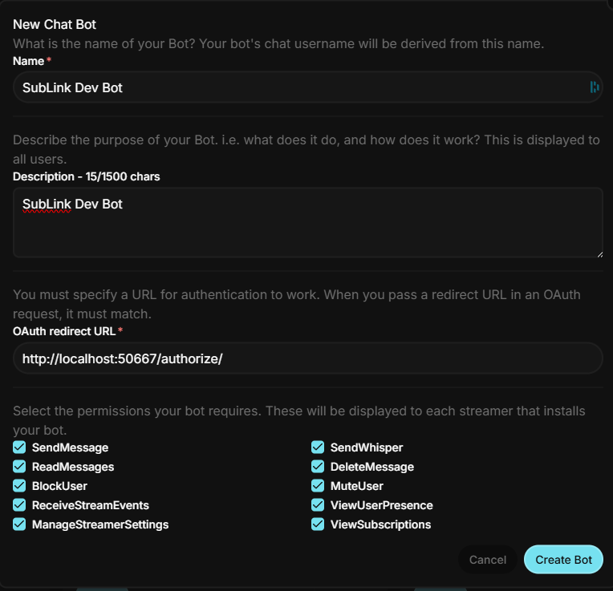
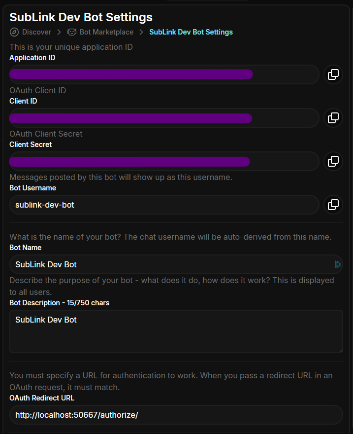

# SubLink Setup Joystick

[Back To Readme](../../README.md)

## Setup

1. On the first run, the application will create a `Settings/Joystick.json` file.
2. Set the `Settings/Joystick.json` file's `Enabled` setting to `true`. (All lowercase!)
3. Create a new **Private** bot
   1. Go to the Joystick bot portal: https://joystick.tv/applications
   2. Create a new Bot by clicking on `New Bot`. Give it a creative name and the settings shown below (OAuth Redurect URL: `http://localhost:50667/authorize/`):
      
   3. Click on `Create Bot`
4. Copy the info from the new bot to your settings file
   
   1. Copy the `Application ID` and set it as the `Settings/Joystick.json` file's `ApplicationId` setting.
   2. Copy the `Client ID` and set it as the `Settings/Joystick.json` file's `ClientId` setting.
   3. Copy the `Client Secret` and set it as the `Settings/Joystick.json` file's `ClientSecret` setting.
5. On the second run, the application will automatically connect to Joystick's real-time API and start receiving events.

**Note** - Joystick's OAuth isn't.. Great.. And will probably force you to re-authenticate each time you launch SubLink because their refresh code doesn't seem to work very well.

**Note** - If you change the OAuth port you also have to change the OAuth Redirect URL!

## Config Template

```json
{
  "Joystick": {
    "Enabled": true,
    "OAuthPort": 50667,
    "ApplicationId": "",
    "ClientId": "",
    "ClientSecret": "",
    "AccessToken": "",
    "RefreshToken": "",
    "State": "",
    "Username": "",
    "ChannelId": ""
  }
}
```
