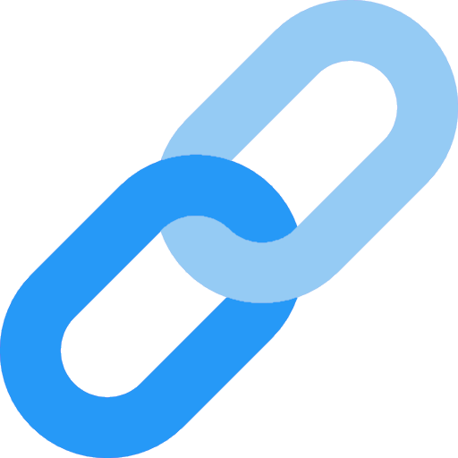
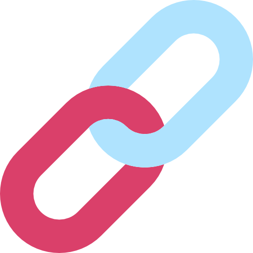

&nbsp;&nbsp;

# SubLink Adult Platforms

These are adult-only (18+ / 21+, depending on your region) platform integrations for SubLink.  
Only use these if you're legal to use them, they have been seperated from the main SubLink repo for end-user comfort.

## Discord

If you need help, feel free to reach out on Twitter or on Discord!

## Setup

- [Fansly Setup](Docs/Setup/Fansly.md)
- [OpenShock Setup](Docs/Setup/OpenShock.md)
- [Joystick Setup](Docs/Setup/Joystick.md)

## Data Types

- [Fansly Data Types](Docs/DataTypes/Fansly/Index.md)
- [OpenShock Data Types](Docs/DataTypes/OpenShock/Index.md)
- [Joystick Data Types](Docs/DataTypes/Joystick/Index.md)

## Actions

- [OpenShock Actions](Docs/Actions/OpenShock/Index.md)
- [Joystick Actions](Docs/Actions/Joystick/Index.md)

## Adding Support to Avatars

To add support for SubLink integrations to your VRChat avatars, I recommend using VRChat's avatar parameter drivers to increment an avatar parameter. For instance, when gift subs or bits come in, OSC will set an avatar parameter such as `TwitchCommunityGift` or `TwitchCheer` to the number gifted or cheered.

You can then create an animator layer with a resting state that transitions to a state with a parameter driver using the respective avatar parameter (e.g., `ExplosionQueue`). This animator layer will increment an internal parameter accordingly and reset the (OSC-set) avatar parameter to zero, allowing for manual radial menu fallback triggers.

From there, you can enqueue animations as needed based on the secondary parameters incremented by the parameter driver.

Default parameters can be found here: [Default_Params.md](Docs/Default_Params.md)

## Support

If you encounter any issues or need assistance, please open an issue in the project repository.

## Contributing

Contributions are welcome! If you have a feature idea, bug fix, or improvement, feel free to create a pull request or open an issue.

## License

SubLink is released under the [MIT License](https://opensource.org/licenses/MIT).
